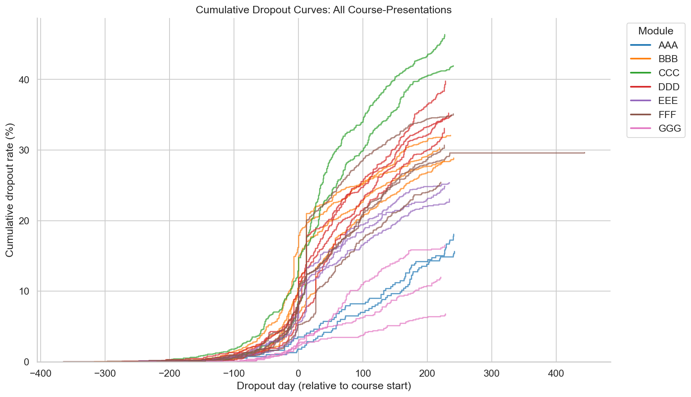
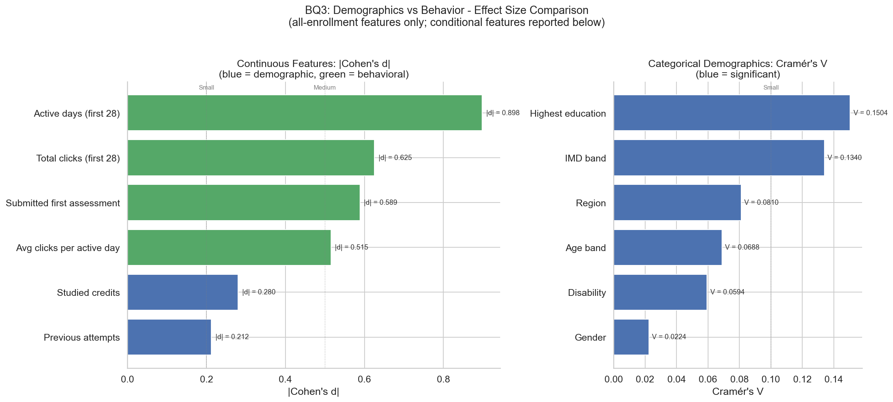
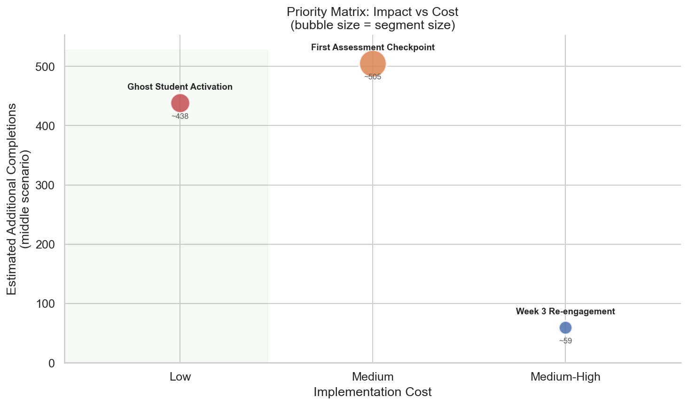

# Learning Retention Analytics <a href="#"></a> <a href="it/README.md"></a>

[](https://github.com/aleattene/learning-retention-analytics/actions/workflows/test.yml)
[](https://github.com/aleattene/learning-retention-analytics/actions/workflows/code_quality.yml)
[](https://codecov.io/gh/aleattene/learning-retention-analytics)
[](https://www.python.org/downloads/)
[](LICENSE)
[](https://analyse.kmi.open.ac.uk/open_dataset)

---

## Overview

A **product analytics case study** that analyzes student retention and
drop-out in online education using the
[Open University Learning Analytics Dataset (OULAD)](https://analyse.kmi.open.ac.uk/open_dataset):
32,593 enrollments by 28,785 distinct students, 7 courses, complete
behavioral clickstream.

The project follows a **SQL-driven analytical pipeline**: DuckDB as a
local-first analytical database, descriptive and inferential statistics,
and a Looker Studio dashboard.

### Why this matters

Online education platforms face 40-60% drop-out rates. Understanding
**where**, **when**, and **why** students disengage is the foundation
for any retention strategy, whether in EdTech, SaaS subscriptions,
or fitness app engagement.

> **Dashboard**: Looker Studio *(coming soon)*

---

## Business Questions

| # | Question | Analytical approach |
|---|----------|---------------------|
| BQ1 | Where and when do students drop out? | Cohort analysis, cumulative dropout curves, cliff detection |
| BQ2 | Which early behavioral signals predict drop-out? | Engagement segmentation (first 28 days), t-test, effect size |
| BQ3 | Does demographics or behavior predict outcome more strongly? | Chi-square, Cramer's V, comparative analysis |
| BQ4 | How do course characteristics affect retention? | Cross-course comparison, correlation with retention rates |
| BQ5 | Top 3 actionable interventions for a platform operator? | Segment sizing, impact estimation, cost-benefit framing |

---

## Methodological Transferability

Every analytical pattern in this project is portable to other domains:

| Pattern | EdTech (this project) | SaaS Retention | Subscription Churn | Fitness App |
|---------|----------------------|----------------|---------------------|-------------|
| Cohort analysis | Enrollment cohort dropout | Trial-to-paid conversion by signup month | Renewal rate by subscription tier | 30-day retention by onboarding flow |
| Funnel analysis | Registration -> first click -> assessment -> completion | Signup -> activation -> habit -> upgrade | Subscribe -> engage -> renew | Download -> first workout -> weekly habit |
| Engagement segmentation | Click intensity in first 28 days | Feature adoption in first 14 days | Usage frequency before renewal window | Session frequency in first month |
| Survival-style dropout | Cumulative withdrawal curves | Time-to-churn Kaplan-Meier | Subscription survival by plan type | Days-to-lapse by activity type |

---

## Tech Stack

| Layer | Technology | Rationale |
|-------|------------|-----------|
| Analytical DB | **DuckDB** (local-first) | Zero-cost, SQL-first, BigQuery migration path |
| SQL dialect | **ANSI SQL** only | No DuckDB-specific syntax - cloud-portable |
| Language | **Python 3.13+** | Pipeline orchestration, statistics, visualization |
| Statistics | **SciPy + statsmodels** | t-test, chi-square, confidence intervals, effect sizes |
| Visualization | **Matplotlib + Seaborn** | Publication-quality charts |
| Dashboard | **Looker Studio** | Free, shareable, Google Sheets as data source |
| CI/CD | **GitHub Actions** | Automated testing + linting |
| Code quality | **black + ruff + pre-commit** | Consistent formatting and linting |

---

## Project Structure

```
project_root/
├── run_pipeline.py                     # Entrypoint: orchestrates ETL
├── src/
│   ├── config.py                       # Paths, constants, env vars
│   ├── db/connection.py                # DB abstraction (DuckDB now, BigQuery later)
│   ├── pipeline/
│   │   ├── step_01_ingest.py           # CSV OULAD → raw DuckDB tables
│   │   ├── step_02_transform.py        # Raw tables → analytical views
│   │   ├── step_03_export.py           # Views → CSV + optional Sheets push
│   │   └── step_04_stats.py            # BQ2/BQ3 statistical tests → CSV
│   ├── stats/tests.py                  # Statistical test wrappers
│   ├── sheets/push.py                  # Google Sheets integration
│   └── utils/                          # Logging, runtime utilities
├── sql/
│   ├── schema.sql                      # DDL for 7 raw OULAD tables
│   ├── views/                          # 5 analytical views
│   └── queries/                        # 5 business question queries
├── notebooks/                          # 7 analysis notebooks (EDA + BQ1-BQ5)
├── reports/
│   ├── REPORT.md                       # Executive report (IT mirror in reports/it/)
│   └── figures/                        # Charts exported by the notebooks
├── data_sample/                        # Synthetic data (~200 students) for CI
├── it/                                 # Italian mirror of this README
├── tests/                              # pytest suite (unit + integration + stress)
└── .github/workflows/                  # test.yml + code_quality.yml
```

---

## Quick Start

### Prerequisites

- Python 3.13+
- [pip-tools](https://pip-tools.readthedocs.io/) for dependency management

### Setup

```bash
# Clone the repository
git clone https://github.com/aleattene/learning-retention-analytics.git
cd learning-retention-analytics

# Create and activate virtual environment
python -m venv .venv
source .venv/bin/activate

# Install dependencies from pinned lockfiles
pip install pip-tools
pip-sync requirements-dev.txt

# Install pre-commit hooks
pre-commit install
```

> **Maintainer note**: to update dependencies, edit the `.in` files and
> re-compile: `pip-compile requirements.in && pip-compile requirements-dev.in && pip-compile requirements-test.in`

### Download the OULAD dataset

```bash
python scripts/download_oulad.py
```

This downloads the full OULAD dataset (~450 MB) into `data/raw/`.

> **Note**: the download script is not yet published *(coming soon)*. In the
> meantime, the dataset can be downloaded manually from the official OULAD
> page linked in the [Dataset](#dataset) section.

### Run the pipeline

```bash
# Full dataset
python -m run_pipeline

# Sample data only (for quick testing)
python -m run_pipeline --sample
```

### Run tests

```bash
# Full test suite with coverage
pytest

# Smoke tests only
pytest tests/test_smoke.py -v
```

---

## Dataset

The [Open University Learning Analytics Dataset (OULAD)](https://analyse.kmi.open.ac.uk/open_dataset)
contains 32,593 course enrollments by 28,785 distinct students across
7 modules (22 presentations) at The Open University (UK).

| Table | Description | Key columns |
|-------|-------------|-------------|
| studentInfo | Demographics + final outcome | id_student, final_result |
| studentRegistration | Enrollment/unenrollment dates | date_registration, date_unregistration |
| studentVle | Clickstream (daily clicks per resource) | id_site, date, sum_click |
| studentAssessment | Assessment scores | id_assessment, score |
| assessments | Assessment metadata | assessment_type, date, weight |
| vle | Virtual Learning Environment (VLE) resource metadata | activity_type |
| courses | Course metadata | module_presentation_length |

**Target variable**: `final_result` ∈ {Pass, Distinction, Fail, Withdrawn},
binarized as Completed (Pass + Distinction) vs Not completed (Fail + Withdrawn).

> **Citation**: Kuzilek, J., Hlosta, M., & Zdrahal, Z. (2017).
> Open University Learning Analytics dataset.
> *Scientific Data*, 4, 170171.
> Licensed under [CC-BY 4.0](https://creativecommons.org/licenses/by/4.0/).

---

## Analysis Notebooks

The full analysis lives in 7 notebooks: two exploratory, one per
business question.

| # | Notebook | Focus |
|---|----------|-------|
| 01 | [EDA: Student Base](notebooks/01_eda_student_base.ipynb) | Population profile, outcomes, data quality baseline |
| 02 | [EDA: Engagement Patterns](notebooks/02_eda_engagement_patterns.ipynb) | Clickstream behavior, engagement typologies, ghost students |
| 03 | [BQ1: Dropout Timing](notebooks/03_bq1_dropout_timing.ipynb) | Cumulative dropout curves, cliff detection |
| 04 | [BQ2: Early Signals](notebooks/04_bq2_early_signals.ipynb) | First-28-day behavioral signals, effect size ranking |
| 05 | [BQ3: Demographics vs Behavior](notebooks/05_bq3_demographics_vs_behavior.ipynb) | Comparative predictive strength of the two feature families |
| 06 | [BQ4: Course Comparison](notebooks/06_bq4_course_comparison.ipynb) | Course design features vs retention |
| 07 | [BQ5: Recommendations Synthesis](notebooks/07_bq5_recommendations_synthesis.ipynb) | Segment sizing, priority matrix, top 3 interventions |

---

## Key Findings

The full analysis is available in the [Executive Report](reports/REPORT.md).
In summary:

- **BQ1**: roughly 1 in 3 enrollments ends in explicit withdrawal; dropout
  clusters around assessment deadlines and grade releases
- **BQ2**: all 8 early behavioral signals (first 28 days) are significantly
  associated with dropout; engagement volume (engagement decile, active days,
  total clicks) dominates the effect size ranking
- **BQ3**: behavior predicts outcome far more strongly than demographics;
  within every education level, high engagement beats low engagement
- **BQ4**: completion rates range from 37% to 71% across the 7 modules;
  suggestive patterns with assessment density, but n = 7 prevents inferential
  conclusions
- **BQ5**: three behavior-based interventions (ghost activation, assessment
  checkpoint, week-3 re-engagement) cover the majority of at-risk students

The story in three charts: the problem, the insight, the action.


*Where the problem lives (BQ1): withdrawal accumulates steadily, with
course-specific cliffs around assessment deadlines.*


*The core insight (BQ3): early behavioral signals carry far larger effect
sizes than any demographic attribute.*


*The action (BQ5): candidate interventions positioned by estimated impact
and implementation cost.*

---

## Documentation

| Document | Content |
|----------|---------|
| [Executive Report](reports/REPORT.md) | Full BQ1–BQ5 analysis with figures and numbers |
| [Methodology](docs/METHODOLOGY.md) | Statistical approach, design choices, trade-offs *(coming soon)* |
| [Transferability](docs/TRANSFERABILITY.md) | Pattern portability to SaaS, subscriptions, fitness *(coming soon)* |
| [Cloud Migration](docs/MIGRATION.md) | DuckDB to BigQuery path, gaps and checklist *(coming soon)* |
| [ADR](docs/ADR.md) | Architectural decisions with rationale *(coming soon)* |
| [Testing](docs/TESTING.md) | Test architecture, strategy, and decisions *(coming soon)* |

---

## Author

[Alessandro Attene](https://www.linkedin.com/in/aleattene)

---

## License

This project is licensed under the [MIT License](LICENSE).

The OULAD dataset is licensed under
[CC-BY 4.0](https://creativecommons.org/licenses/by/4.0/) - see citation above.
