# Student Retention Analysis — Executive Report

> Open University Learning Analytics Dataset (OULAD) | 32,593 enrollments | 7 courses
>
> Audience: Head of Product | Observational analysis — associations, not causal claims | No ML

---

## Methodology

This report synthesizes findings from a SQL-driven analytical pipeline applied to the
OULAD dataset — 32,593 student-course enrollments across 7 modules, with complete
behavioral clickstream, assessment records, and demographic profiles.

**Outcome definition:** Each enrollment is classified as *Completed* (Pass or Distinction)
or *Not completed* (Fail or Withdrawn). This binary split is consistent with the OULAD
literature and enables clean retention analysis.

**Statistical toolkit:**

| Method | Used for | Reported metrics |
|--------|----------|------------------|
| Welch's t-test | Continuous signals vs. outcome | t-statistic, p-value, Cohen's d |
| Chi-square test | Categorical demographics vs. outcome | chi-square, p-value, Cramer's V |
| Bonferroni + Benjamini-Hochberg | Multiple comparison correction | Adjusted p-values |
| Bootstrap CI | Extreme-rate groups (e.g., ghost students) | 95% confidence intervals |

All tests use a significance threshold of alpha = 0.05. Effect size — not p-value — is the
primary criterion for ranking predictors, because with ~32K observations even trivial
differences reach statistical significance. No machine learning models are used. All
findings are observational associations.

---

## BQ1 — Where and When Do Students Drop Out?

> **Key finding:** Approximately one in three enrollments ends in explicit withdrawal.
> Dropout is not random — it clusters around course milestones, and its temporal
> profile differs across modules.

Across the 7 OULAD modules, withdrawal rates range from **11.8%** (module GGG) to
**44.2%** (module CCC). The overall weighted withdrawal rate is approximately **31%**
of all enrollments — a substantial share of the student population that never reaches
completion.

Cumulative dropout curves reveal **distinct temporal profiles** per course. Some modules
experience steep early attrition (an onboarding failure pattern), while others show more
gradual mid-course decline. Within the same module, different presentations (cohorts)
follow broadly similar trajectories, suggesting that course design — not random cohort
variation — drives the dropout shape.

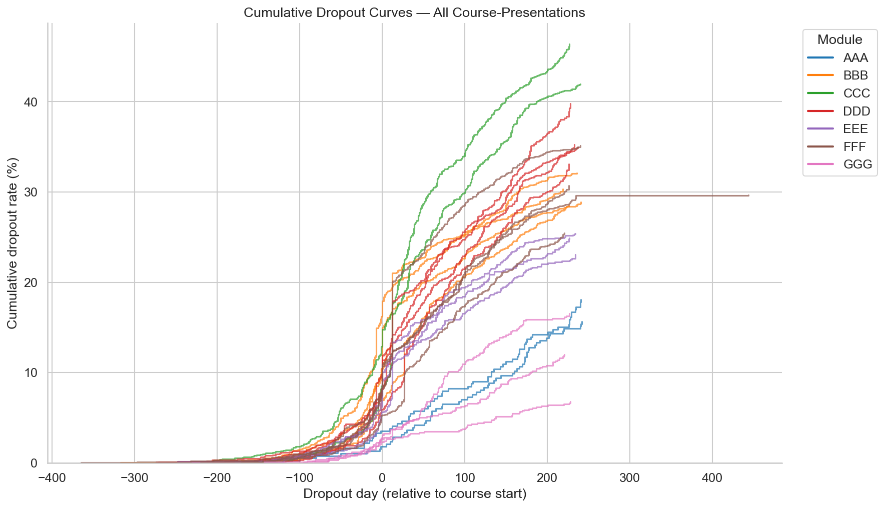

*Cumulative dropout curves show distinct temporal profiles per course. Each line
represents one course-presentation, colored by module.*

**Cliff events** — days with disproportionately large numbers of withdrawals (above the
95th percentile for that course) — align with assessment deadlines and grade releases.
These are actionable: interventions can be timed to precede known cliff dates.

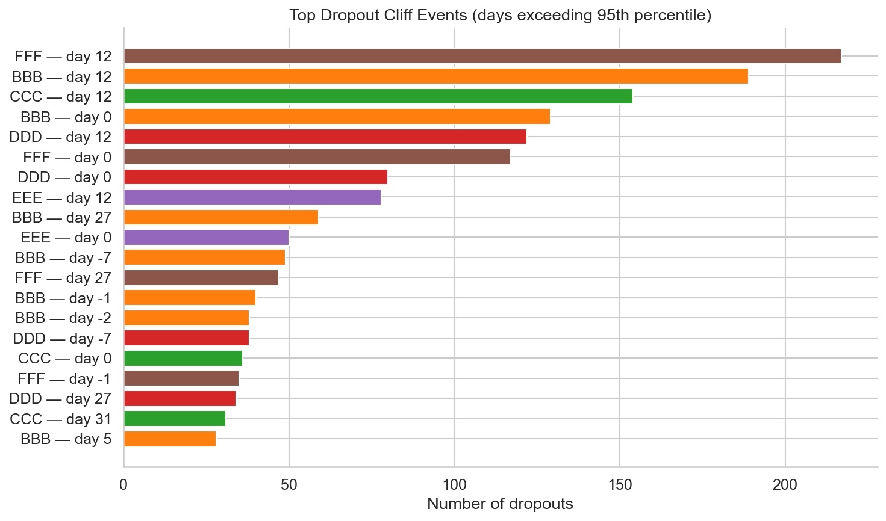

*Cliff events detected via p95 threshold. The largest single-day dropout spikes
correspond to course milestones.*

A measurable share of withdrawals occur **before the course even starts** (dropout
day < 0). These pre-course withdrawals represent pure registration churn — students
who enrolled but never experienced any content. This is an activation problem, not an
academic one.

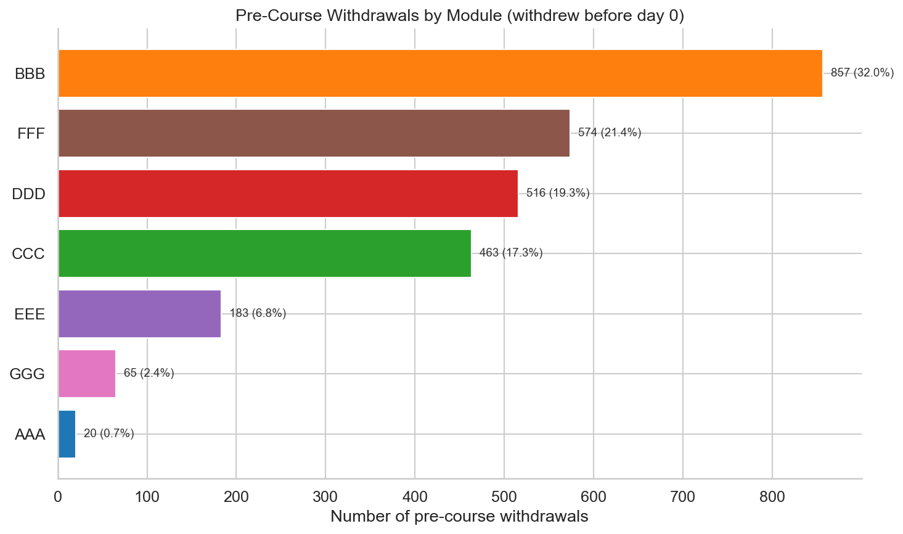

*Pre-course withdrawals by module. These students need onboarding nudges, not
academic support.*

Knowing *when* students leave raises the next question: can we see it coming?

---

## BQ2 — Which Early Signals Predict Dropout?

> **Key finding:** All 8 early engagement metrics tested are significantly associated
> with dropout after multiple comparison correction (8/8 after both Bonferroni and
> Benjamini-Hochberg). The strongest predictors are engagement-volume metrics —
> active days and total clicks in the first 28 days.

Using only the first 28 days of enrollment data, we tested 8 behavioral signals for
their association with eventual completion. Effect size (Cohen's d) — not p-value — is
the primary ranking criterion, because with ~32K observations significance is easy to
achieve.

The **forest plot** below ranks all signals by absolute effect size. Engagement-volume
metrics (active days, total clicks, within-course engagement decile) dominate the
ranking, followed by last active day and average click intensity.

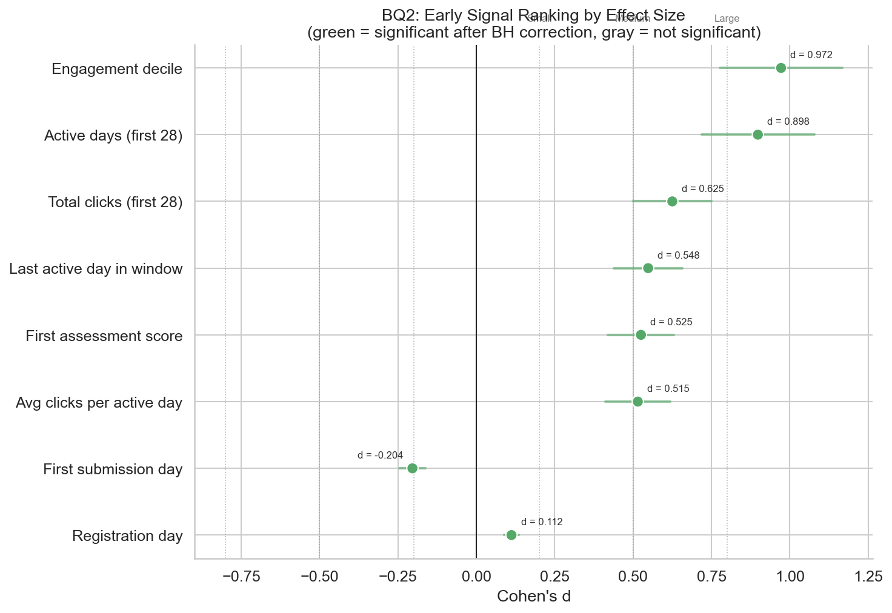

*All 8 signals ranked by Cohen's d. Green dots indicate significance after
Benjamini-Hochberg correction. Vertical reference lines mark small, medium, and
large effect thresholds.*

The most dramatic contrast is between **ghost students** — those with zero VLE activity
in the first 28 days — and active students. Ghost students have a near-zero completion
rate, while active students complete at a rate close to the platform average. The 95%
bootstrap confidence intervals do not overlap. (Note: BQ5 broadens this definition to
include near-zero activity — ≤1 active day AND <10 clicks — to capture the full
at-risk segment for intervention targeting.)

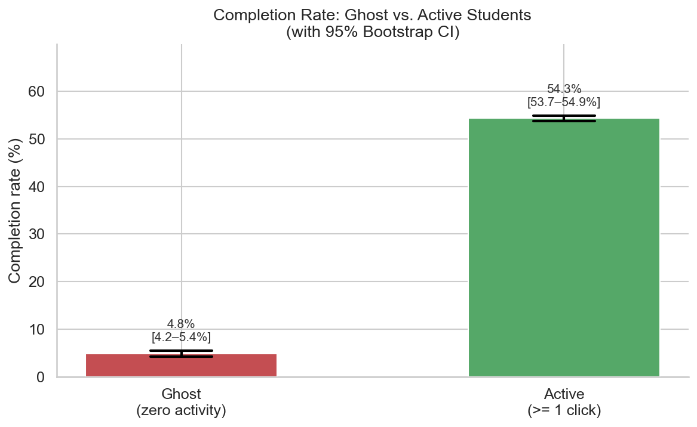

*Ghost students — zero VLE activity in the first 28 days — have near-zero completion
rates. Error bars show 95% bootstrap confidence intervals.*

The dose-response relationship is **monotonic**: more engagement consistently predicts
higher completion, with no threshold or diminishing returns. This means the signal is
useful across its entire range, not just at extremes.

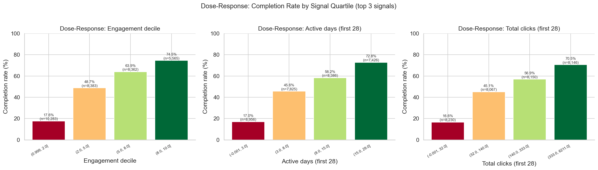

*Completion rate by signal quartile for the top 3 predictors. The relationship is
graded, not binary.*

Two additional insights strengthen the signal portfolio. **Assessment submission** is a
powerful binary predictor: students who submitted at least one assessment in the first
28 days complete at substantially higher rates than non-submitters. And **consistency
beats intensity** — regular daily logins predict completion more strongly than high
click-per-session bursts.

These behavioral signals are strong — but are they merely proxies for demographics?

---

## BQ3 — Demographics or Behavior: What Matters More?

> **Key finding:** Behavior dominates. Behavioral effect sizes are multiple times larger
> than demographic effect sizes. Within every education level, high engagement
> dramatically outperforms low engagement.

We tested 6 categorical demographic features (gender, age band, education level, IMD
band, disability, region) and 2 numeric demographic features (previous attempts, studied
credits) against completion outcome. All 8 are statistically significant after
Benjamini-Hochberg correction — but their effect sizes are uniformly weak. The strongest
demographic predictor (highest education) has a Cramer's V below **0.13**; all others
fall below **0.11**.

By contrast, behavioral features (active days, total clicks, assessment submission,
click intensity) show effect sizes several times larger. The gap is stark: behavioral
signals predict outcome far more strongly than any demographic variable.

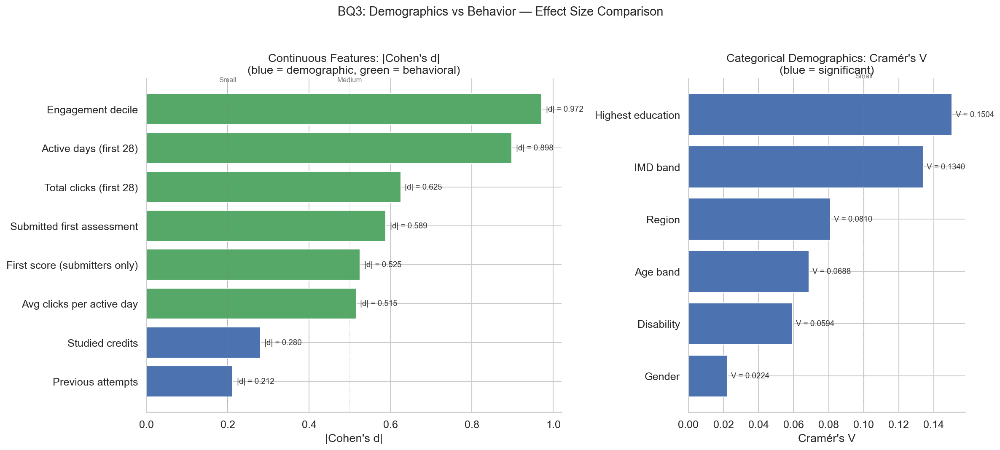

*Direct comparison of demographic and behavioral effect sizes. The gap is
substantial — behavioral signals are consistently stronger.*

The critical test: does engagement merely reflect demographics? The interaction plot
below shows that within **every education level**, high-engagement students dramatically
outperform low-engagement students. A student with lower formal education but high
engagement has a better chance of completing than a highly educated student who does not
engage with the platform.

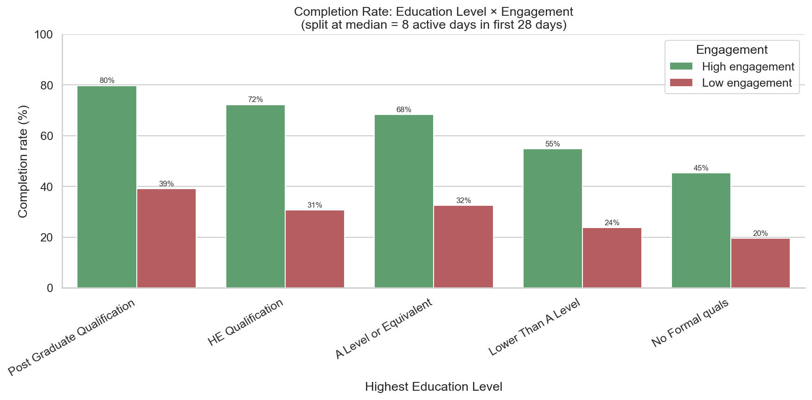

*Within every education level, the engagement gap dwarfs the education gap.
Behavior is the swing factor, not background.*

This finding has an **ethical dimension**: behavioral signals are both statistically
stronger *and* actionable. Demographics cannot be changed; behavior can be influenced
through platform design. Targeting behavior avoids the fairness concerns inherent in
demographic profiling.

Does course design itself influence engagement levels?

---

## BQ4 — How Do Course Characteristics Affect Retention?

> **Key finding:** Completion rates vary substantially across the 7 modules — from
> **37.4%** (CCC) to **70.9%** (AAA), a **33.5 percentage point** gap. Suggestive
> patterns emerge around assessment density and course length, but with only 7 data
> points no inferential conclusions are possible.

The ranking chart below shows the full spread. Module AAA retains nearly three-quarters
of its students; module CCC loses almost two-thirds.

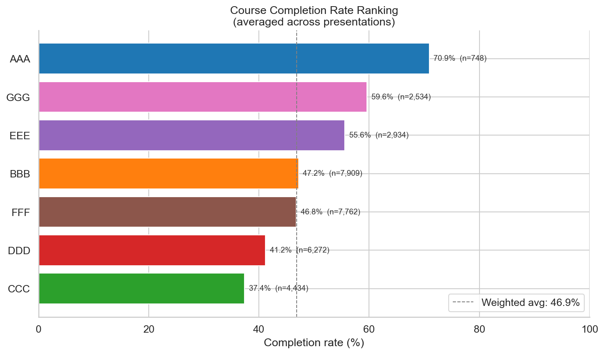

*Completion rates vary from 37.4% to 70.9% across the 7 OULAD modules.*

Exploratory scatter plots reveal suggestive patterns between course design features
(assessment density, course length) and completion rates. However, with n = 7, any
correlation is descriptive, not inferential — Spearman rank correlation requires
`|rho| > 0.79` for significance at this sample size.

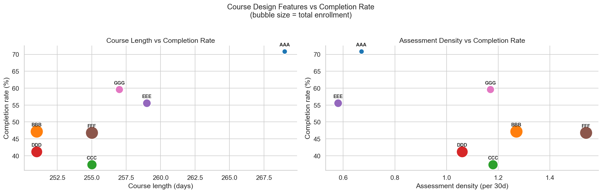

*Assessment density and course length show suggestive associations with completion.
Each point is one module (averaged across its presentations).*

**Critical caveats:** These patterns are confounded by at least three factors: (1) subject
difficulty — some modules teach inherently harder material; (2) student self-selection —
more motivated students may choose certain courses; (3) institutional investment —
resource allocation varies across departments. Course design is a lever worth studying,
but it requires more data (more courses, or experimental variation) to draw conclusions.

Drawing from all four analyses above, we now propose three concrete interventions.

---

## BQ5 — Top 3 Recommended Interventions

> **Key finding:** Three behavior-based interventions, ordered by impact-to-cost ratio,
> together address the majority of at-risk students. Because segments overlap
> significantly, a sequenced rollout avoids redundant outreach.

### Target Segments

The BQ5 query sizes three student segments defined by observable, actionable criteria —
not demographics. All definitions use first-28-day behavioral data.

| Segment | Definition | Size | Non-completion rate |
|---------|-----------|------|---------------------|
| **Ghost students** | ≤1 active day AND <10 clicks | **5,555** (17.0%) | **92.3%** |
| **Assessment non-submitters** | No assessment submitted in first 28 days | **11,494** (35.3%) | **71.8%** |
| **Early disengagers** | Activity in days 0–14, zero in days 15–28 | **2,213** (6.8%) | **77.8%** |

All three segments show non-completion rates far above the platform baseline (~53%).

### The Three Interventions

| | Ghost Activation | Assessment Checkpoint | Week 3 Re-engagement |
|---|---|---|---|
| **Priority** | 1 — Quick win | 2 — Build next | 3 — Invest when ready |
| **Trigger** | Zero VLE activity by day 3 | 3 days before first deadline, not submitted | 3+ consecutive inactive days after initial activity |
| **Action** | Email sequence: day-3 welcome + day-7 follow-up with first-step link | Reminder with assessment preview and time estimate | "We miss you" email with progress summary and peer comparison |
| **Cost** | **Low** — email automation only | **Medium** — deadline-aware triggers + course calendar | **Medium-High** — real-time activity tracking + personalization |
| **Evidence** | BQ2: early engagement is strongest predictor; BQ3: behavior > demographics | BQ2: assessment submission is a key binary signal; BQ1: cliffs at deadlines | BQ1: mid-course dropout cliffs at weeks 3–4; BQ2: last-active-day predictor |
| **Impact estimate** | Largest — widest gap between segment and platform rate | Medium — substantial submitter vs non-submitter gap | Medium — targets distinct failure mode from ghosts |

**Impact estimation approach:** For each intervention, we model conservative conversion
scenarios (10–25% of targeted students change behavior). Converted ghost students are
assumed to achieve the platform-average completion rate — not the active-student rate.
Re-engaged students are assumed to reach a rate halfway between disengaged and sustained.
These are deliberately conservative assumptions.

### Segment Overlap

Ghost students and assessment non-submitters **overlap heavily** — a student with zero
VLE access cannot submit an assessment. This means interventions 1 and 2 largely target
the same population from different angles; their impact should not be summed naively.
Early disengagers, by definition, had initial activity — they overlap less with ghosts,
making intervention 3 an independent lever targeting a different failure mode.

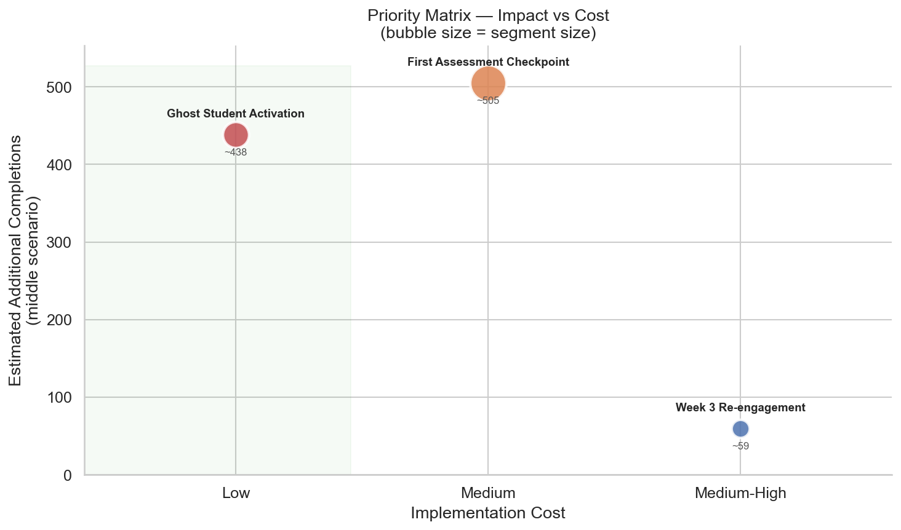

*Impact-vs-cost priority matrix. Ghost Activation is the clear quick win:
largest segment, highest excess non-completion, lowest cost.*

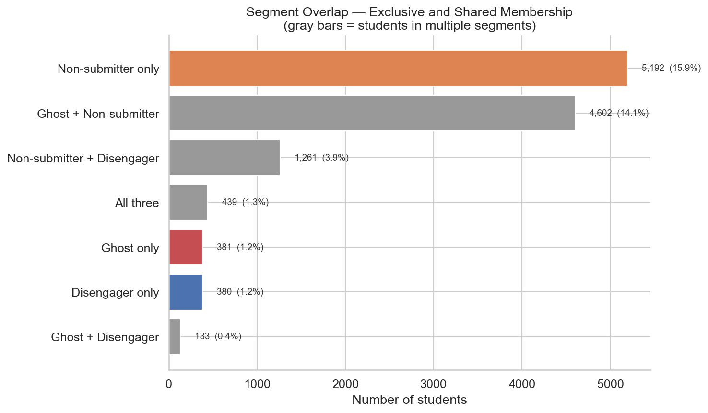

*Segment overlap analysis. Gray bars show students belonging to multiple segments.
The ghost–non-submitter overlap is substantial.*

---

## Limitations and Caveats

- **Observational data only.** All effect sizes and completion rate differences are
  associations, not causal relationships. Engaged students may be inherently more
  motivated — engagement could be a proxy, not a cause.
- **Historical data.** OULAD covers 2013–2014 cohorts at the UK Open University.
  Student behavior and online learning platforms have evolved significantly since then.
- **BQ4 limited by n = 7.** With only 7 modules, no inferential statistics are possible
  for course-level analysis. Design feature patterns are hypotheses, not conclusions.
- **Impact estimates are assumptions.** Conversion rates (10–25%) are plausible
  projections based on industry benchmarks, not measured outcomes. No A/B testing data
  exists in the dataset.
- **No cost data.** Implementation cost estimates (Low / Medium / Medium-High) are
  qualitative. Actual engineering effort depends on existing platform infrastructure.
- **Ethical note.** All interventions target behavior, not demographics. Automated
  outreach should include opt-out mechanisms to respect student autonomy.
