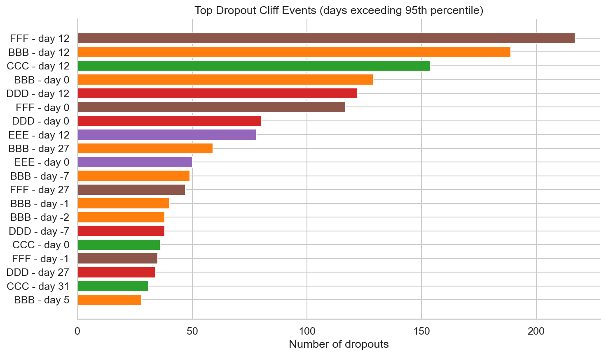
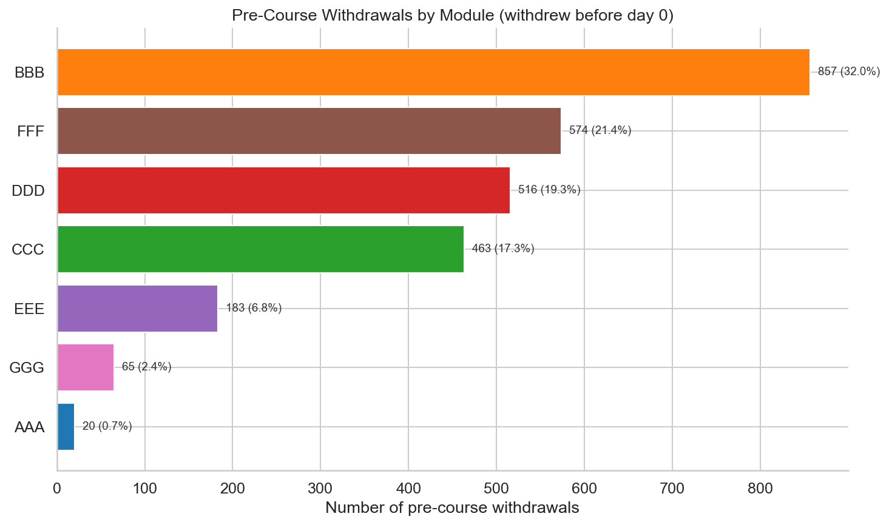
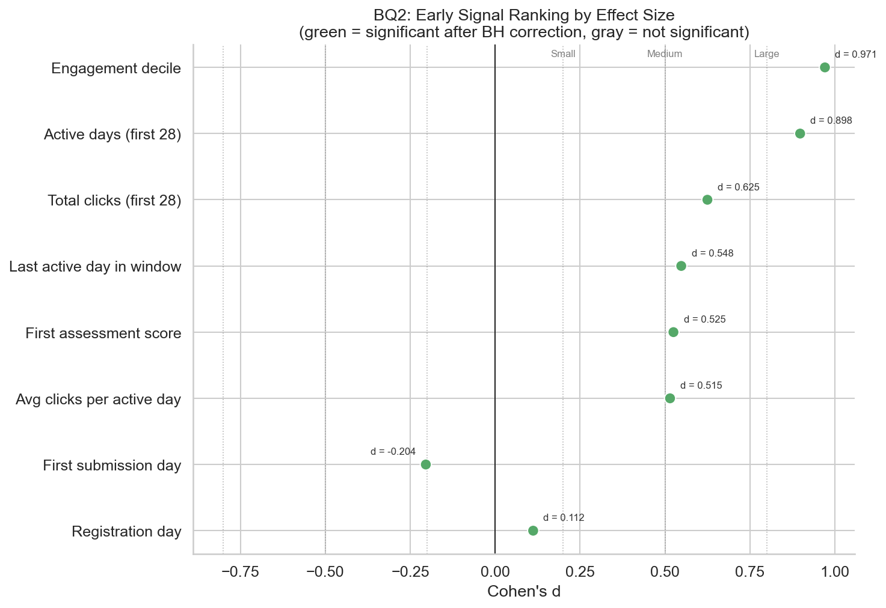
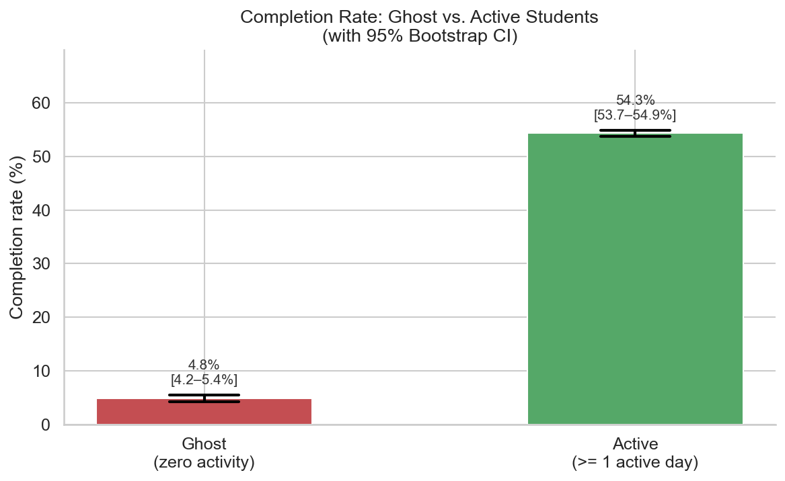
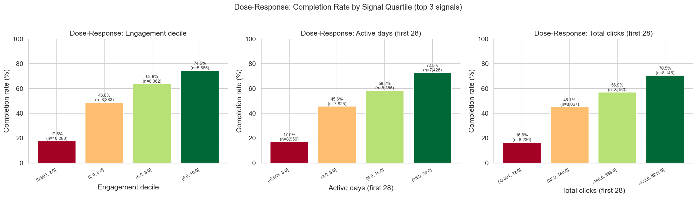
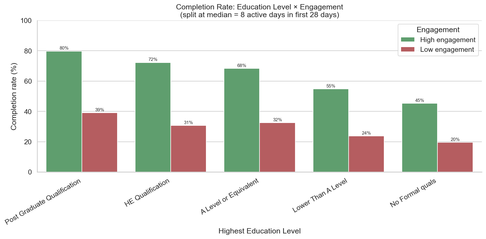
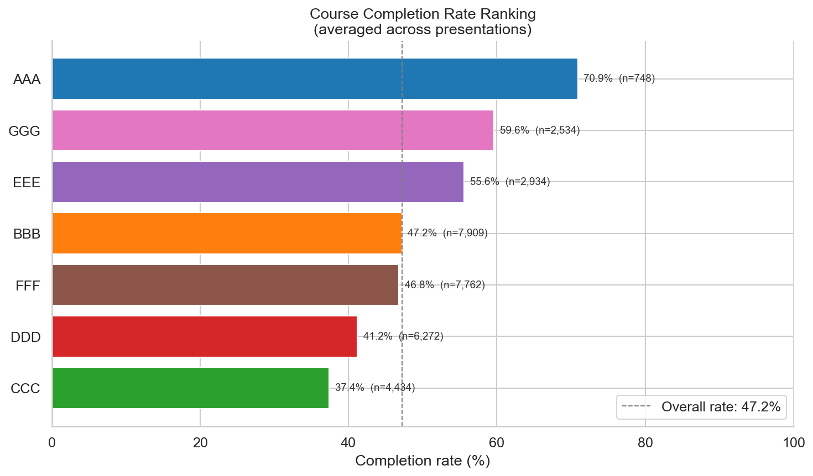
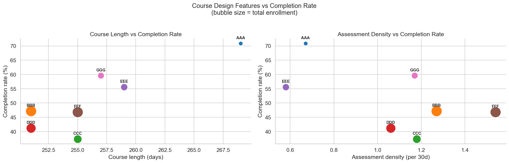
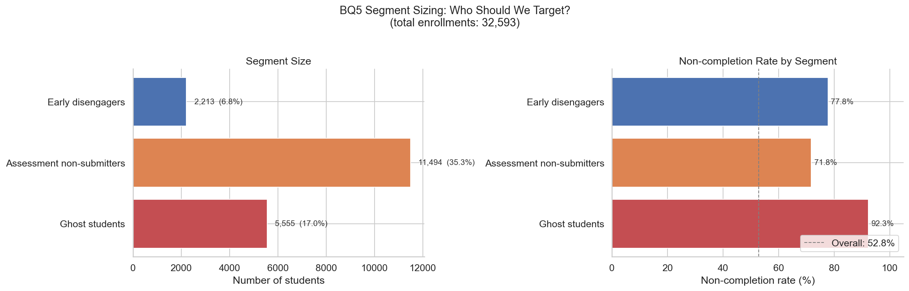
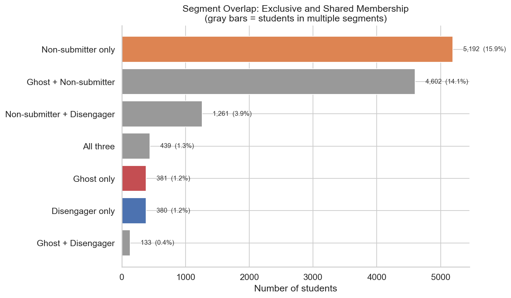

# Student Retention Analysis: Executive Report  

> **Data-driven analysis of student retention and drop-out in online education**

> **Data**: [Open University Learning Analytics Dataset (OULAD)](https://analyse.kmi.open.ac.uk/open_dataset), 
> 32,593 enrollments across 7 courses. Historical dataset (2013–2014 cohorts), stable: no updates expected.

> **Author**: [Alessandro Attene](https://www.linkedin.com/in/aleattene)

> **Analysis started**: April 2026

> **Last revised**: September 2026

---

 

## Executive Summary

Roughly one in three enrollments ends in explicit withdrawal, and dropout is not
random: it clusters around course milestones (assessment deadlines and grade releases).

Behavioral signals from the first 28 days predict the outcome far more strongly than any
demographic variable, and they make it possible to identify at-risk students early with
interventions that require no demographic profiling.

### The Five Key Numbers

| Metric | Value |
|--------|-------|
| Enrollments analyzed | 32,593, across 7 courses (22 presentations) |
| Overall withdrawal rate | ~31%, ranging from 11.8% to 44.2% by module |
| Strongest predictor | Engagement decile in the first 28 days (Cohen's d\* = 0.97) |
| Behavior vs demographics gap | Best demographic predictor: education, Cramer's V\* = 0.15, outperformed by every major behavioral signal |
| Highest-risk segment | Ghost students: 5,555 enrollments (17.0%), 92.3% non-completion |

\* Both effect size measures (Cohen's d and Cramer's V) are explained, with scale
and a worked example, in the [Methodology](#methodology) section.

**Recommended actions** (details in BQ5): 
- ghost-student activation by day 3
- a checkpoint before the first assessment deadline
- week-3 re-engagement

---

 

## Methodology

This report synthesizes findings from a SQL-driven analytical pipeline applied to the
OULAD dataset: 32,593 student-course enrollments across 7 modules, with:
- complete behavioral clickstream from the university's Virtual Learning Environment (VLE)
- assessment records
- demographic profiles.

**Outcome definition.** Each enrollment is classified into one of two classes:

- **Completed**: final result Pass or Distinction
- **Not completed**: final result Fail or Withdrawn

This binary split is consistent with the OULAD literature and enables clean
retention analysis.

**Statistical toolkit:**

| Method | Used for | Reported metrics |
|--------|----------|------------------|
| Welch's t-test\* | Continuous signals vs. outcome | t-statistic, p-value, Cohen's d |
| Chi-square test | Categorical demographics vs. outcome | chi-square, p-value, Cramer's V |
| [Bonferroni](https://en.wikipedia.org/wiki/Bonferroni_correction) and [Benjamini-Hochberg](https://en.wikipedia.org/wiki/False_discovery_rate) | Multiple comparison correction | Adjusted p-values |
| Bootstrap CI\*\* | Extreme-rate groups (e.g., ghost students) | 95% confidence intervals |

\* The t-test compares the means of two groups and asks whether the observed difference could be explained by
pure chance. Welch's variant does not assume the two groups share the same variability: it is the safer choice
when the compared groups differ substantially in size, as they do here (completers vs. non-completers).
More: [Welch's t-test](https://en.wikipedia.org/wiki/Welch%27s_t-test) (Wikipedia).

\*\* CI = Confidence Interval: the range of values within which, with 95% confidence,
the true value lies. Here it is estimated via bootstrap, that is by resampling the
observed data many times.

All tests use a significance threshold of alpha = 0.05. Effect size, not p-value, is the
primary criterion for ranking predictors, because with ~32K observations even trivial
differences reach statistical significance. No machine learning models are used. All
findings are observational associations.

### How to Read the Numbers

**p-value**: how unlikely it would be to observe a difference at least this large
if, in reality, there were no difference at all. Below the alpha = 0.05 threshold
the difference is called statistically significant.

**Cohen's d** (for numeric variables): measures the distance between two groups in
units of typical variability (standard deviations). Reference scale:

- d ≈ 0.2: small effect
- d ≈ 0.5: medium effect
- d ≥ 0.8: large effect

**Worked example with the project's real data.** 
*In the first 28 days, students who will eventually complete the course are active on
average 12.8 days; those who will not, 6.5. The difference (6.33 days), divided by the
pooled standard deviation of the two groups (about 7.05 days), gives
d = 6.33 / 7.05 ≈ 0.90: a large effect.*

**Cramer's V** (for categorical variables): measures the strength of association
between two variables on a scale from 0 to 1:
- **0**: **no** association
- **1**: **perfect** association 

With a binary outcome, values around 0.1 indicate a **weak** association, around 0.3 **medium**, 0.5 and above **strong**.

**Worked example with the project's real data.** 
*For education level the chi-square test yields 737.2 on 32,593 enrollments. 
With a binary outcome the formula reduces to V = square root of (737.2 / 32,593) ≈ 0.15: a **weak** association.*

---

 

## BQ1: Where and When Do Students Drop Out?

> **Key finding:** approximately **one in three enrollments** ends in **explicit withdrawal**.
> Dropout is not random: it clusters around specific course milestones, and its temporal
> profile differs across modules.

Across the 7 OULAD modules, withdrawal rates range from **11.8%** (module GGG) to
**44.2%** (module CCC). The overall weighted withdrawal rate is approximately **31%**
of all enrollments: a substantial share of the student population that never reaches
completion.

Cumulative dropout curves reveal **distinct temporal profiles** per course. 
Some modules lose many students within the very first weeks (the typical signature of a
failing onboarding), while others show a more gradual mid-course decline. 
Within the same module, different presentations (cohorts) follow broadly similar
trajectories, suggesting that course design, not random cohort variation, drives the
dropout shape.

A note for reading the chart: the horizontal axis starts at negative values because
enrollment opens well ahead of the actual course start (day 0). A withdrawal in the
negative range of the axis therefore means the student unenrolled before the course even
began: this phenomenon is analyzed a little further down in this section.

*Cumulative dropout curves show distinct temporal profiles per course. Each line
represents one course-presentation, colored by module.*

The second pattern concerns **cliff events\***: days when withdrawals do not grow
gradually but spike all at once, as if students fell off a step together (hence the
name, from cliff). These spikes do not land on random days: they coincide with
assessment deadlines and grade releases.

\* Cliff event: a day with a disproportionately high number of withdrawals compared to
the rest of the course, above the 95th percentile (that is, with more withdrawals than
95% of the other days of that course).

*Cliff events detected via p95 threshold. As can easily be seen, the largest single-day
dropout spikes correspond to course milestones: assessment deadlines and grade releases.*

For whoever runs the platform this regularity is good news: if the critical days are
predictable, action can be taken in advance. A reminder, or an offer of help, sent a few
days before a deadline lands exactly when the risk of dropping out peaks.

More than a quarter of explicit withdrawals (26.6%, 2,678 of 10,072) occur **before
the course even starts** (dropout day < 0). These pre-course withdrawals represent
pure registration churn: students who enrolled but never experienced any content. 
This is an **activation problem**, not an academic one.

*Pre-course withdrawals by module. These students do not need academic support: they
need a gentle welcome nudge that walks them to their first login.*

Knowing **when** students leave raises the next question: **can we see it coming**?

---

 

## BQ2: Which Early Signals Predict Dropout?

> **Key finding:** all 8 early engagement metrics tested are significantly associated
> with dropout after multiple comparison correction (8/8 after both Bonferroni and
> Benjamini-Hochberg). The strongest predictors are engagement-volume metrics:
> within-course engagement decile, active days, and total clicks in the first 28 days.
> In plain terms: how much, and how often, a student uses the platform in the first
> four weeks already says a great deal about how the course will end.

Using only the first 28 days of enrollment data, we tested the association between
**8 behavioral signals** and eventual course completion. 
Effect size (Cohen's d), not p-value, is the **primary ranking criterion**, because with
~32K observations significance is easy to achieve.

The **forest plot** below ranks all signals by **absolute effect size**.
Engagement-volume metrics dominate the ranking: 
- within-course engagement decile (d = 0.97), that is the student's position in their
course's engagement ranking, split into ten bands
- active days (d = 0.90)
- total clicks (d = 0.63)

Next, with medium effects (d between 0.52 and 0.55), come last active day, first
assessment score and average click intensity; first submission day and registration day
close the ranking. 
Assessment-based signals are computed on the subpopulation of students who submitted at
least one assessment (the submitters).

*All 8 signals ranked by Cohen's d. Green dots indicate significance after
Benjamini-Hochberg correction. Vertical reference lines mark small, medium, and
large effect thresholds.*

The starkest contrast is between **ghost students** (those with zero VLE activity
in the first 28 days) and active students:
- ghost students have a near-zero completion rate
- active students complete at a rate close to the platform average. 

The 95% bootstrap confidence intervals do not overlap. 
(Note: BQ5 broadens this definition to include near-zero activity, that is at most 1
active day and fewer than 10 clicks, to capture the full at-risk segment when selecting
the recipients of the interventions.)

*Ghost students (zero VLE activity in the first 28 days) have near-zero completion
rates. Error bars show 95% bootstrap confidence intervals.*

The dose-response relationship is **monotonic**: more engagement consistently predicts
higher completion, with no threshold or diminishing returns. This means the signal is
useful across its entire range of values, not just at extremes.

*Completion rate by signal quartile for the top 3 predictors. The relationship is
graded, not binary.*

Two additional insights strengthen the signal portfolio:

- **assessment submission** is a powerful binary predictor: students who submitted at
least one assessment in the first 28 days complete at substantially higher rates than
those who submitted nothing

- **consistency beats intensity**: regular daily logins predict completion more
strongly than a few concentrated sessions with very many clicks

It is true that these behavioral signals are strong. But are they merely a reflection of demographics?

---

 

## BQ3: What Matters More, Demographics or Behavior?

> **Key finding:** **behavior dominates**. Behavioral effect sizes are multiple times
> larger than demographic effect sizes. Within every education level, high engagement
> clearly outperforms low engagement.

Against the final course outcome (completed or not completed), we tested:
- **6 categorical demographic variables**:
  - gender
  - age band
  - education level
  - Index of Multiple Deprivation (IMD) band
  - disability
  - region

- **2 numeric demographic variables**:
  - previous attempts
  - studied credits
 
The final result is that **all 8** are **statistically significant** after
**Benjamini-Hochberg** correction ([more on Wikipedia](https://en.wikipedia.org/wiki/False_discovery_rate)), 
but their **effect sizes** are **uniformly weak**. 
The strongest demographic predictor (highest education level) reaches a Cramer's V of approximately **0.15**.
The IMD band follows at **0.13**, and all other demographic variables stay below **0.09**.

By contrast, **behavioral variables** (active days, total clicks, assessment
submission, click intensity) show **effect sizes** several times **larger**. 

The gap is stark: **behavioral signals predict outcome far more strongly than any
demographic variable**.

*Direct comparison of demographic and behavioral effect sizes. The gap is
substantial: behavioral signals are consistently stronger.*

The critical test: does engagement merely reflect demographics? The interaction plot
below shows that within **every education level**, high-engagement students clearly
outperform low-engagement students. A student with lower formal education but high
engagement has a better chance of completing than a highly educated student who does not
engage with the platform.

*Within every education level, the engagement gap dwarfs the education gap.
**Behavior** is the **swing factor**, not background.*

This finding also has an **ethical dimension**: behavioral signals are not only the
statistically stronger ones, they are also the ones the platform can actually act on. 
A student's demographics cannot be changed; their behavior can, through platform design. 
Focusing interventions on behavior also avoids the fairness concerns inherent in
demographic profiling.

In light of this, the next question comes naturally: *is it course design itself that
influences engagement levels?*

---

 

## BQ4: How Do Course Characteristics Affect Retention?

> **Key finding:** completion rates vary substantially across the 7 modules, going from
> **37.4%** (CCC) to **70.9%** (AAA), a **33.5 percentage point** gap. 
> Suggestive patterns emerge around assessment density and course length, but with only
> 7 courses (7 data points) no inferential conclusions are possible.

The chart below shows the full ranking. Module AAA retains nearly three-quarters
of its students, while module CCC loses almost two-thirds.

*Completion rates vary from 37.4% to 70.9% across the 7 OULAD modules.*

Exploratory scatter plots reveal suggestive patterns between course design features
(assessment density, course length) and completion rates. However, as noted, with n = 7
any correlation is descriptive, not inferential: Spearman's correlation\* requires 
|rho| > 0.79 for significance with a sample this small.

\* Spearman's correlation measures how much two quantities move together by looking at
the order of the values (their rankings) instead of the exact values: rho = 1 when one
always grows as the other grows, rho = 0 when there is no relationship, rho = -1 when
the relationship is perfectly inverse. With only 7 courses, only a near-perfect
relationship (|rho| > 0.79) can be distinguished from pure chance. More: 
[Spearman's rank correlation coefficient](https://en.wikipedia.org/wiki/Spearman%27s_rank_correlation_coefficient) 
(Wikipedia).

*Assessment density and course length show suggestive associations with completion.
Each point is one module (averaged across its presentations).*

**Critical caveats.** These patterns are entangled with at least three factors the data cannot separate:
- subject difficulty, since some modules teach inherently harder material
- student self-selection, since more motivated students may choose certain courses
- institutional investment, since resource allocation varies across departments

Course design is therefore a lever worth studying, but it requires more data (more
courses, or experimental variation) to draw conclusions that genuinely support decisions.

Drawing on all four analyses above, **we now propose three concrete interventions**.

---

 

## BQ5: Top 3 Recommended Interventions

> **Key finding:** three behavior-based interventions, ordered by impact-to-cost ratio, 
> together address the majority of at-risk students. 
> Because the segments overlap significantly, a sequenced rollout of the interventions
> avoids contacting the same students repeatedly with redundant messages.

### Target Segments

The BQ5 query sizes three student segments defined by criteria that are observable and
that the platform can act on directly, not demographic ones. 
All definitions use first-28-day behavioral data.

| Segment | Definition | Size | Non-completion rate |
|---------|-----------|------|---------------------|
| **Ghost students** | ≤1 active day and <10 clicks | **5,555** (17.0%) | **92.3%** |
| **Assessment non-submitters** | No assessment submitted in first 28 days | **11,494** (35.3%) | **71.8%** |
| **Early disengagers** | Activity in days 0–14, zero in days 15–28 | **2,213** (6.8%) | **77.8%** |

A note on the metric: the table reports the **non-completion** rate (fails and
withdrawals together), not the withdrawal rate used in BQ1. For intervention design both
negative outcomes matter: a student who reaches the end of the course and fails is still
a student the platform did not manage to carry across the finish line.

All three segments show non-completion rates far above the platform baseline (~53%). 
Ghost students complete at just 7.7%, against a platform average of 47.2%.

*Size of the three target segments and their non-completion rates, compared with the
platform-wide value.*

### The Three Interventions

| | Ghost Activation                                                                     | Assessment Checkpoint                                                    | Week 3 Re-engagement                                                                          |
|---|--------------------------------------------------------------------------------------|--------------------------------------------------------------------------|-----------------------------------------------------------------------------------------------|
| **Priority** | 1: Quick win                                                                         | 2: Build next                                                            | 3: Invest when ready                                                                          |
| **Trigger** | Zero VLE\* activity by day 3                                                         | 3 days before first deadline, not submitted                              | 3+ consecutive inactive days after initial activity                                           |
| **Action** | Email sequence: day-3 welcome and day-7 follow-up with first-step link               | Reminder with assessment preview and time estimate                       | "We miss you" email with progress summary and peer comparison                                 |
| **Cost** | **Low** (email automation only)                                                      | **Medium** (deadline-aware triggers and course calendar)                 | **Medium-High** (real-time activity tracking and personalization)                             |
| **Evidence** | BQ2: early engagement is strongest predictor; BQ3: behavior > demographics           | BQ2: submission is a key binary signal; BQ1: cliffs at deadlines         | BQ1: mid-course dropout cliffs at weeks 3-4; BQ2: last-active-day predictor                   |
| **Impact estimate** | Largest: widest gap between segment and platform rate                                | Medium: substantial submitter vs non-submitter gap                       | Medium: intercepts a different dropout mode than ghosts                                       |

\* VLE = Virtual Learning Environment, the online platform where the course content lives.

**Impact estimation approach:** for each intervention we model conservative conversion
scenarios, assuming that only 10–25% of the students reached change their behavior.
We further assume that converted ghost students can reach the platform-average
completion rate (not the active-student rate) and that re-engaged students settle at a
rate halfway between disengaged and sustained. 
These are deliberately conservative assumptions.

### Segment Overlap

Ghost students and assessment non-submitters **overlap heavily**: a student with zero
VLE access cannot submit an assessment. This means interventions 1 and 2 largely reach
the same population from different angles. Their impact should therefore not be summed
naively. 
Early disengagers, by definition, did have initial activity: they overlap less with
ghosts, which makes the third intervention ([Week 3 Re-engagement](#the-three-interventions))
an independent lever that intercepts a different dropout mode.

*Impact-to-cost priority matrix. Ghost Activation is the clear quick win (the largest
result for the smallest effort): largest segment, highest excess non-completion and
lowest cost.*

*Segment overlap analysis. Gray bars show students belonging to multiple segments.
The overlap between ghosts and non-submitters is substantial.*

---

 

## Limitations and Caveats

- **Observational data only.** All effect sizes and completion rate differences are
associations, not causal relationships. Engaged students may be inherently more
motivated: engagement could be a proxy (an indicator reflecting something else, such as
motivation), not a cause.

- **Historical data.** OULAD covers 2013–2014 cohorts at the UK Open University. Student
behavior and online learning platforms have changed significantly since then.

- **BQ4 limited by n = 7.** With only 7 modules, no inferential statistics are possible
for course-level analysis. Design feature patterns are hypotheses, not conclusions.

- **Impact estimates are assumptions.** Conversion rates (10–25%) are plausible
projections based on industry benchmarks, not measured outcomes. No A/B testing data
exists in the dataset.

- **No cost data.** Implementation cost estimates (Low / Medium / Medium-High) are
qualitative. Actual engineering effort depends on existing platform infrastructure.
 

- **Ethical note.** All interventions act on behavior, not demographics. Automated
communications to students should always include an opt-out mechanism, to respect
student autonomy.

---

 

## Appendix: Provenance of Charts and Numbers

All figures in this report are generated by the 7 analysis notebooks in
[`notebooks/`](../notebooks/): the numeric prefix of each image file matches the
notebook that produces it (for example `03_dropout_curves_overlaid.png` comes from
`03_bq1_dropout_timing.ipynb`). 
The notebooks read the CSVs exported by the pipeline and save each figure in two
languages under the same file name: English in `reports/figures/` (used by the EN
documents), Italian in `reports/figures/it/` (used by the Italian report and README).

The numbers quoted in the text are verified against the same pipeline-exported CSVs, in
particular the statistical exports (`stats_*.csv`) for effect sizes and confidence
intervals. 
Instructions to regenerate figures and data from a repository clone are in the
[README](../README.md), Getting Started section.
