# Analisi della Retention Studentesca: Report Esecutivo  

> Analisi **data-driven** della **retention** e dell'abbandono degli studenti nella **formazione online**

> **Dati**: [Open University Learning Analytics Dataset (OULAD)](https://analyse.kmi.open.ac.uk/open_dataset), 
> 32.593 iscrizioni su 7 corsi. Dataset storico (coorti 2013–2014), stabile: nessun aggiornamento previsto.

> **Autore**: [Alessandro Attene](https://www.linkedin.com/in/aleattene)

> **Avvio dell'analisi**: aprile 2026

> **Ultima revisione**: settembre 2026

---

 

## Sintesi esecutiva

Circa un'iscrizione su tre termina con il ritiro esplicito e l'abbandono non risulta essere casuale: si concentra 
infatti intorno alle tappe del corso (scadenze delle valutazioni e rilascio dei voti).

I segnali comportamentali dei primi 28 giorni predicono l'esito molto più fortemente di qualsiasi variabile
demografica e permettono inoltre di individuare presto gli studenti a rischio, con interventi che non richiedono 
alcuna profilazione demografica.

### I cinque numeri chiave

| Metrica | Valore |
|---------|--------|
| Iscrizioni analizzate | 32.593, su 7 corsi (22 presentazioni) |
| Tasso di ritiro complessivo | ~31%, dall'11,8% al 44,2% a seconda del modulo |
| Predittore più forte | Decile di engagement nei primi 28 giorni (d di Cohen\* = 0,97) |
| Divario comportamento vs demografia | Miglior predittore demografico: istruzione, V di Cramér\* = 0,15, superato da tutti i principali segnali comportamentali |
| Segmento più a rischio | Studenti ghost: 5.555 iscrizioni (17,0%), non completamento al 92,3% |

\* Le due misure di effect size (d di Cohen e V di Cramér) sono spiegate, con scala
ed esempio svolto, nella sezione [Metodologia](#metodologia).

**Azioni raccomandate** (dettagli in BQ5): 
- attivazione degli studenti ghost entro il giorno 3
- checkpoint prima della prima scadenza di valutazione
- re-engagement alla settimana 3

---

 

## Metodologia

Questo report sintetizza i risultati di una pipeline analitica SQL-driven applicata al dataset OULAD: 32.593 
iscrizioni studente-corso distribuite su 7 moduli, con:
- clickstream comportamentale completo dal Virtual Learning Environment (VLE) dell'università
- record delle valutazioni
- profili demografici.

**Definizione dell'outcome.** Ogni iscrizione è classificata in una delle due seguenti classi:

- **Completato**: esito finale Pass o Distinction
- **Non completato**: esito finale Fail o Withdrawn

Questa suddivisione binaria è coerente con la letteratura OULAD e consente un'analisi di retention pulita.

**Toolkit statistico:**

| Metodo                          | Utilizzato per | Metriche riportate |
|---------------------------------|----------------|---------------------|
| t-test di Welch\*               | Segnali continui vs outcome | t-statistic, p-value, d di Cohen |
| Test chi-quadrato               | Variabili demografiche categoriche vs outcome | chi-quadrato, p-value, V di Cramér |
| [Bonferroni](https://en.wikipedia.org/wiki/Bonferroni_correction) e [Benjamini-Hochberg](https://en.wikipedia.org/wiki/False_discovery_rate) | Correzione per confronti multipli | p-value corretti |
| Bootstrap CI\*\*                | Gruppi con tassi estremi (es. studenti ghost) | Intervalli di confidenza al 95% |

\* Il t-test confronta le medie di due gruppi e valuta se la differenza osservata sia spiegabile dal puro caso. 
La variante di Welch non assume che i due gruppi abbiano la stessa variabilità: è la scelta più prudente quando i 
gruppi confrontati hanno dimensioni molto diverse, come qui (chi completa e chi non completa). Approfondimento: 
[Welch's t-test](https://en.wikipedia.org/wiki/Welch%27s_t-test) (Wikipedia, in inglese).

\*\* CI = Confidence Interval (intervallo di confidenza): la forbice di valori entro cui, con il 95% di confidenza, 
cade il valore vero. Qui è stimata via bootstrap, cioè ricampionando molte volte i dati osservati.

Tutti i test utilizzano una soglia di significatività alfa = 0,05. L'effect size, non il p-value, è il criterio 
primario per classificare i predittori, perché con ~32K osservazioni anche differenze banali raggiungono la 
significatività statistica. Non vengono utilizzati modelli di machine learning. 
Tutti i risultati sono associazioni osservazionali.

### Come leggere i numeri

**Engagement**: termine inglese che indica la partecipazione attiva dello studente alla piattaforma (accessi, 
giorni di attività, click sui materiali). Non ha un equivalente italiano altrettanto compatto ("coinvolgimento 
attivo" è la resa più vicina) ed è quindi mantenuto come termine tecnico in tutto il report.

**p-value**: indica quanto sarebbe improbabile osservare una differenza almeno così grande se, nella realtà, non ci 
fosse alcuna differenza. Sotto la soglia alfa = 0,05 la differenza si dice statisticamente significativa.

**d di Cohen** (per variabili numeriche): misura la distanza tra due gruppi in unità di variabilità tipica (deviazioni 
standard). Scala di riferimento:

- d ≈ 0,2: effetto piccolo
- d ≈ 0,5: effetto medio
- d ≥ 0,8: effetto grande

**Esempio con i dati reali del progetto.** 
*Nei primi 28 giorni, chi poi completerà il corso è attivo in media 12,8 giorni. Chi non lo completerà, 6,5.
La differenza (6,33 giorni), rapportata alla deviazione standard aggregata dei due gruppi (circa 7,05 giorni), 
restituisce d = 6,33 / 7,05 ≈ 0,90: un effetto grande.*

**V di Cramér** (per variabili categoriche): misura la forza dell'associazione tra due variabili su una scala che va 
da 0 a 1:
- **0**: **nessuna** associazione
- **1**: associazione **perfetta** 

Con un outcome binario, valori intorno a 0,1 indicano un'associazione **debole**, intorno a 0,3 **media**, da 0,5 in su **forte**.

**Esempio con i dati reali del progetto.** 
*Per il livello di istruzione il test **chi-quadrato** vale 737,2 su 32.593 iscrizioni. 
Con outcome binario la formula si riduce a V = radice quadrata di (737,2 / 32.593) ≈ 0,15: un'associazione **debole**.*

---

 

## BQ1: Dove e quando gli studenti abbandonano?

> **Risultato chiave:** circa **un'iscrizione su tre** termina con il **ritiro esplicito**.
> L'abbandono non è casuale: si concentra intorno a specifiche tappe del corso, e il suo profilo temporale varia 
> tra i moduli.

Tra i 7 moduli OULAD, i tassi di ritiro vanno dall'**11,8%** (modulo GGG) al **44,2%** (modulo CCC). 
Il tasso di ritiro complessivo ponderato è circa il **31%** di tutte le iscrizioni: una quota significativa della 
popolazione studentesca che non raggiunge mai il completamento.

Le curve cumulative di abbandono rivelano **profili temporali distinti** per corso. 
Alcuni moduli perdono molti studenti già nelle prime settimane (il segnale tipico di un onboarding che fallisce), 
mentre altri presentano un declino più graduale a metà corso. 
All'interno dello stesso modulo, presentazioni (coorti) diverse seguono traiettorie sostanzialmente simili,
suggerendo che è il design del corso, non la variazione casuale della coorte, a determinare la forma dell'abbandono.

Una nota per leggere il grafico: l'asse orizzontale parte da valori negativi perché l'iscrizione ai corsi apre con 
largo anticipo rispetto all'inizio delle lezioni (il giorno 0). Un ritiro nella zona negativa dell'asse significa 
quindi che lo studente si è cancellato prima ancora che il corso cominciasse: il fenomeno è analizzato poco più 
avanti in questa sezione.

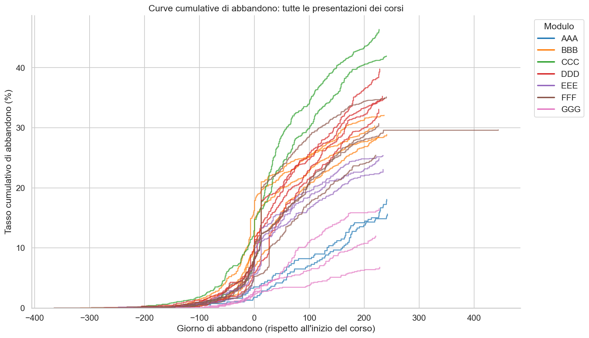

*Le curve cumulative di abbandono mostrano profili temporali distinti per corso. 
Ogni linea rappresenta una presentazione del corso, colorata per modulo.*

Il secondo pattern riguarda i **cliff event\***: giorni in cui i ritiri non crescono in modo graduale, ma si 
impennano all'improvviso, come se gli studenti cadessero tutti insieme da un gradino (in inglese cliff, precipizio). 
Questi picchi non arrivano in giorni qualsiasi: coincidono con le scadenze delle valutazioni e con il rilascio 
dei voti.

\* Cliff event: giorno con un numero di ritiri sproporzionatamente alto rispetto al resto del corso, sopra il 
95° percentile (cioè con più ritiri del 95% degli altri giorni di quel corso).

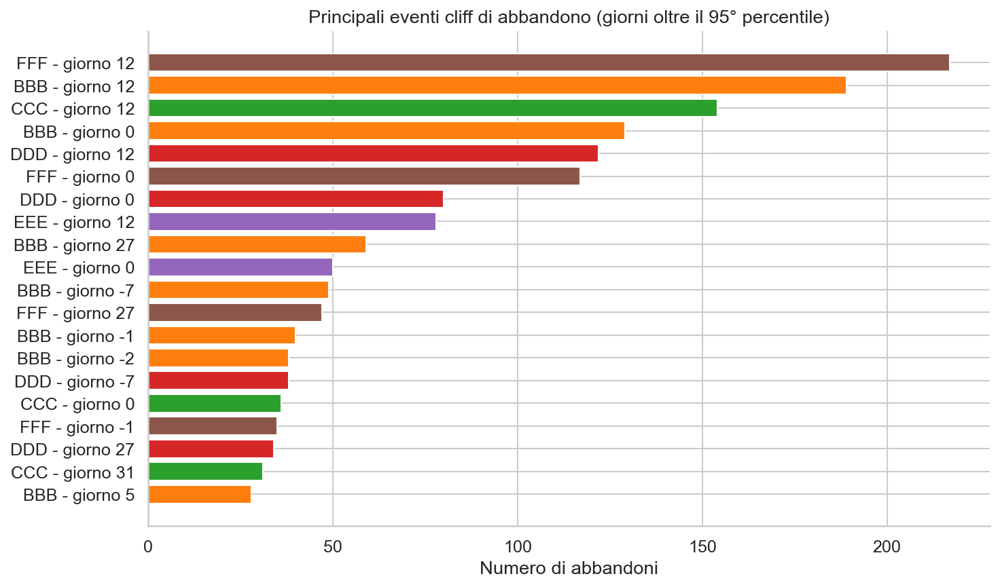

*Cliff event rilevati tramite soglia p95. Come si può facilmente osservare, i picchi di abbandono più grandi in un 
singolo giorno corrispondono a tappe del corso: scadenze delle valutazioni e rilascio dei voti.*

Per chi gestisce la piattaforma questa regolarità è una buona notizia: se i giorni critici sono prevedibili, si può 
agire in anticipo. Un promemoria, o un'offerta di aiuto, inviati pochi giorni prima di una scadenza arrivano proprio 
nel momento in cui il rischio di abbandono è massimo.

Oltre un quarto dei ritiri espliciti (26,6%, ovvero 2.678 su 10.072) avviene **prima ancora dell'inizio del corso** 
(giorno di dropout < 0). Questi ritiri pre-corso rappresentano puro churn di registrazione: studenti che si sono 
iscritti ma non hanno mai fruito di alcun contenuto. 
Si tratta di un **problema di attivazione**, non accademico.

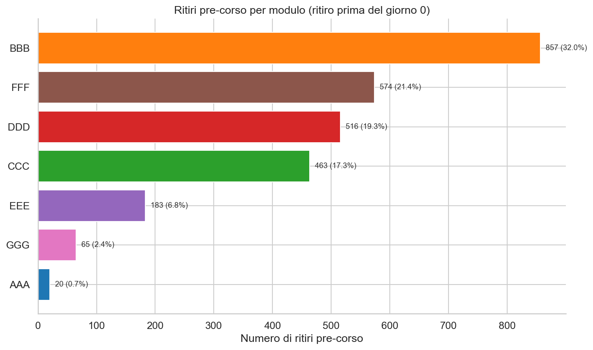

*Ritiri pre-corso per modulo. Questi studenti non hanno bisogno di supporto accademico: serve piuttosto una spinta 
gentile di benvenuto (in gergo, un nudge) che li accompagni fino al primo accesso.*

Sapere **quando** gli studenti se ne vanno solleva la domanda successiva: **possiamo prevederlo**?

---

 

## BQ2: Quali segnali precoci predicono l'abbandono?

> **Risultato chiave:** tutte le 8 metriche di engagement precoce testate sono
> significativamente associate all'abbandono dopo correzione per confronti multipli
> (8/8 dopo Bonferroni e Benjamini-Hochberg). I predittori più forti sono le metriche
> di volume dell'engagement: decile di engagement intra-corso, giorni attivi e click
> totali nei primi 28 giorni. In parole semplici: quanto, e quanto spesso, uno studente
> usa la piattaforma nelle prime quattro settimane dice già molto su come finirà il corso.

Utilizzando solo i dati dei primi 28 giorni di iscrizione, abbiamo testato l'associazione tra **8 segnali 
comportamentali** e il completamento finale del corso. 
L'effect size (d di Cohen), non il p-value, è il **criterio primario** di **classificazione**, dato che con
~32K osservazioni la significatività è facile da raggiungere.

Il **forest plot** sottostante classifica tutti i segnali per **effect size assoluto**.
Le metriche di volume dell'engagement dominano la classifica: 
- decile di engagement intra-corso (d = 0,97), cioè la posizione dello studente nella classifica di engagement 
del proprio corso, divisa in dieci fasce
- giorni attivi (d = 0,90)
- click totali (d = 0,63)

Seguono, con effetti medi (d tra 0,52 e 0,55), l'ultimo giorno attivo, il punteggio della prima valutazione e 
l'intensità media dei click; chiudono la classifica il giorno della prima consegna e il giorno di registrazione. 
I segnali basati sulle valutazioni sono calcolati sulla sola sottopopolazione di chi ha consegnato almeno una 
valutazione (i submitter).

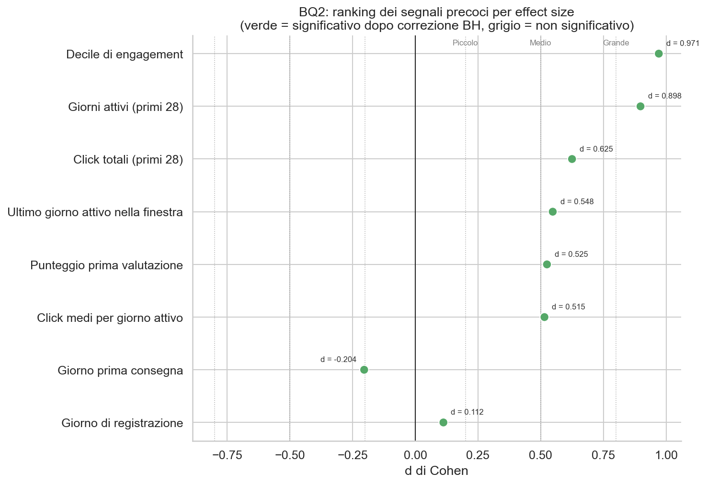

*Tutti gli 8 segnali classificati per d di Cohen. I punti verdi indicano significatività
dopo correzione Benjamini-Hochberg. Le linee di riferimento verticali segnano le soglie
di effect size piccolo, medio e grande.*

Il contrasto più netto è tra gli **studenti ghost** (quelli con zero attività VLE
nei primi 28 giorni) e gli studenti attivi:
- gli studenti ghost hanno un tasso di completamento prossimo allo zero
- gli studenti attivi completano a un tasso vicino alla media della piattaforma. 

Gli intervalli di confidenza bootstrap al 95% non si sovrappongono. 
(Nota: BQ5 amplia questa definizione per includere l'attività quasi nulla, cioè al massimo 1 giorno attivo e meno 
di 10 click, per catturare l'intero segmento a rischio quando si individuano i destinatari degli interventi.)

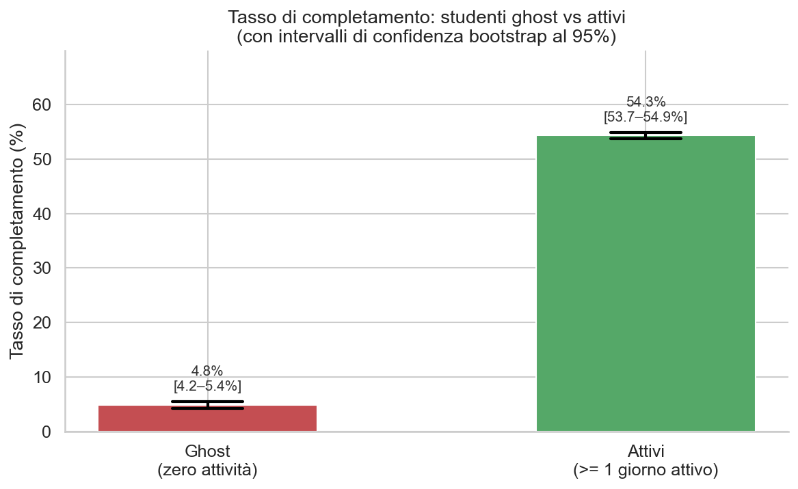

*Gli studenti ghost (zero attività VLE nei primi 28 giorni) hanno tassi di completamento
prossimi allo zero. Le barre di errore mostrano intervalli di confidenza bootstrap al 95%.*

La relazione dose-risposta è **monotonica**: più engagement predice costantemente un
completamento più alto, senza soglia né rendimenti decrescenti. Questo significa che il
segnale è utile lungo tutto il suo intervallo di valori, non solo agli estremi.

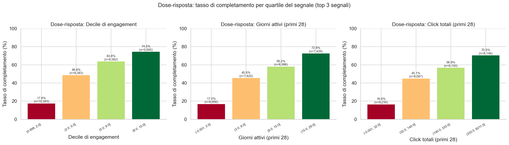

*Tasso di completamento per quartile del segnale per i 3 predittori principali. La
relazione è graduata, non binaria.*

Due insight aggiuntivi rafforzano il portafoglio di segnali:

- la **consegna delle valutazioni** è un potente predittore binario: gli studenti che hanno consegnato almeno
una valutazione nei primi 28 giorni completano a tassi sostanzialmente più alti di chi non ha consegnato nulla

- la **costanza batte l'intensità**: accessi giornalieri regolari predicono il completamento più fortemente 
di poche sessioni concentrate con moltissimi click

È vero che questi segnali comportamentali sono molto forti. Ma sono semplicemente un riflesso della demografia?

---

 

## BQ3: Cosa conta di più, demografia o comportamento?

> **Risultato chiave:** il **comportamento domina**. Gli effect size comportamentali sono
> multipli rispetto a quelli demografici. All'interno di ogni livello di istruzione,
> l'engagement alto supera nettamente l'engagement basso.

Rispetto all'esito finale del corso (completato o non completato), abbiamo testato:
- **6 variabili demografiche categoriche**:
  - genere
  - fascia d'età
  - livello di istruzione
  - fascia IMD (Index of Multiple Deprivation)
  - disabilità
  - regione

- **2 variabili demografiche numeriche**:
  - tentativi precedenti
  - crediti studiati
 
Il risultato finale è stato che **tutte** le 8 sono **statisticamente significative** dopo correzione 
**Benjamini-Hochberg** ([approfondimento su Wikipedia, in inglese](https://en.wikipedia.org/wiki/False_discovery_rate)), 
ma i loro **effect size** sono **uniformemente deboli**. 
Il predittore demografico più forte (livello di istruzione più alto) raggiunge una V di Cramér di circa **0,15**.
Segue la fascia IMD con **0,13** e tutte le altre variabili demografiche restano sotto **0,09**.

Di contro, le **variabili comportamentali** (giorni attivi, click totali, consegna delle valutazioni, intensità 
dei click) mostrano **effect size** diverse volte **superiori**. 

Il divario è netto: **i segnali comportamentali predicono l'esito molto più fortemente di qualsiasi
variabile demografica**.

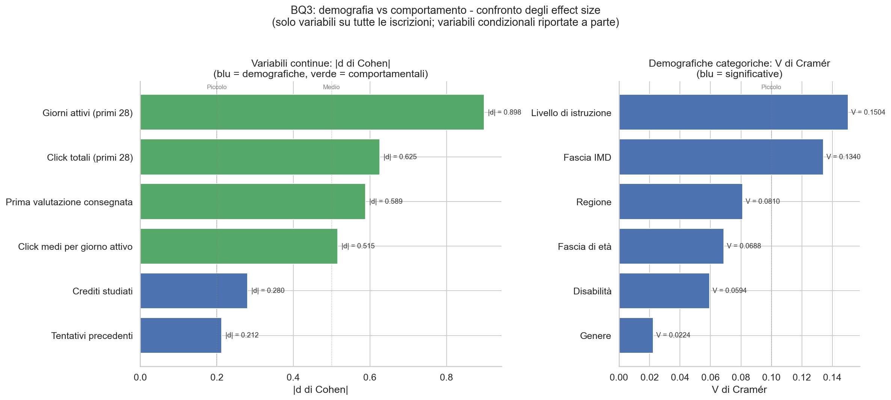

*Confronto diretto degli effect size demografici e comportamentali. Il divario è
sostanziale: i segnali comportamentali sono costantemente più forti.*

Il test critico: l'engagement riflette semplicemente la demografia? Il grafico di 
interazione sottostante mostra che all'interno di **ogni livello di istruzione**, gli
studenti ad alto engagement superano nettamente quelli a basso engagement. Uno
studente con un livello di istruzione formale inferiore ma alto engagement ha più
probabilità di completare rispetto a uno studente altamente istruito che non interagisce
con la piattaforma.

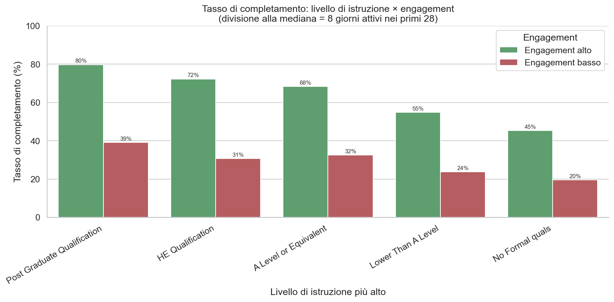

*All'interno di ogni livello di istruzione, il gap di engagement sovrasta il gap
educativo. Il **comportamento** è il **fattore determinante**, non il background.*

Questo risultato ha anche una **dimensione etica**: i segnali comportamentali non sono soltanto i più forti 
statisticamente, sono anche quelli su cui la piattaforma può davvero agire. 
La demografia di uno studente non si può cambiare; il suo comportamento sì, attraverso il design della piattaforma. 
Concentrare gli interventi sul comportamento evita inoltre le preoccupazioni di equità insite nella profilazione 
demografica.

Alla luce di questo, la domanda successiva nasce spontanea: *è il design del corso stesso a influenzare i livelli 
di engagement?*

---

 

## BQ4: Come le caratteristiche dei corsi influenzano la retention?

> **Risultato chiave:** i tassi di completamento variano sostanzialmente tra i 7 moduli, andando dal **37,4%** (CCC) 
> al **70,9%** (AAA), ovvero un gap di **33,5 punti percentuali**. 
> Pattern suggestivi emergono intorno alla densità delle valutazioni e alla durata del corso, ma
> con soli 7 corsi (7 punti dati) non è possibile alcuna conclusione inferenziale.

Il grafico sottostante mostra la classifica completa. Il modulo AAA trattiene
quasi tre quarti dei suoi studenti, mentre il modulo CCC ne perde quasi due terzi.

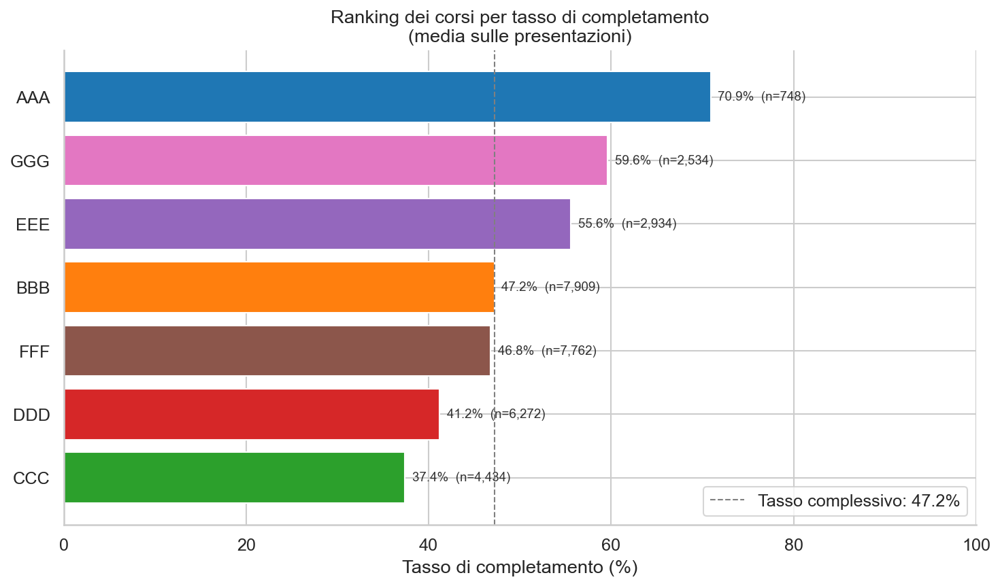

*I tassi di completamento vanno dal 37,4% al 70,9% tra i 7 moduli OULAD.*

Gli scatter plot esplorativi rivelano pattern suggestivi tra le caratteristiche del design
del corso (densità delle valutazioni, durata) e i tassi di completamento. Tuttavia, come detto, con n = 7
qualsiasi correlazione è descrittiva, non inferenziale: la correlazione di Spearman\* richiede infatti 
|rho| > 0,79 per la significatività con un campione così piccolo.

\* La correlazione di Spearman misura quanto due grandezze si muovono insieme guardando l'ordine dei valori 
(le posizioni in classifica) invece dei valori esatti: rho = 1 quando al crescere dell'una cresce sempre anche 
l'altra, rho = 0 quando non c'è alcun legame, rho = -1 quando il legame è perfettamente inverso. Con soli 7 corsi, 
solo un legame quasi perfetto (|rho| > 0,79) si può distinguere dal puro caso. Approfondimento: 
[Spearman's rank correlation coefficient](https://en.wikipedia.org/wiki/Spearman%27s_rank_correlation_coefficient) 
(Wikipedia, in inglese).

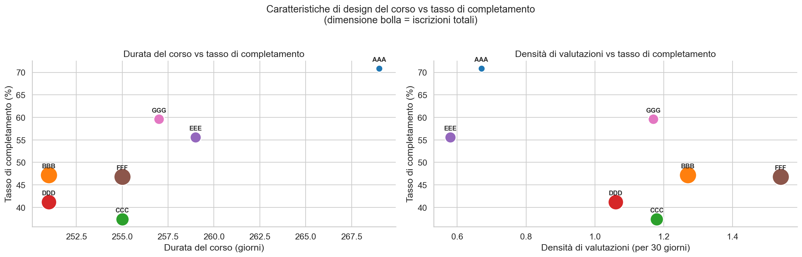

*La densità delle valutazioni e la durata del corso mostrano associazioni suggestive con
il completamento. Ogni punto è un modulo (mediato sulle sue presentazioni).*

**Avvertenze critiche.** Questi pattern si intrecciano con almeno tre fattori che i dati non permettono di separare:
- difficoltà della materia, perché alcuni moduli insegnano contenuti intrinsecamente più difficili
- auto-selezione degli studenti, perché studenti più motivati potrebbero scegliere determinati corsi
- investimento istituzionale, perché l'allocazione delle risorse varia tra i dipartimenti

Il design del corso è quindi una leva che vale la pena studiare, ma richiede più dati (più corsi, o variazione 
sperimentale) per trarre conclusioni interessanti e di reale supporto alle decisioni.

Attingendo da tutte e quattro le analisi precedenti, **si propongono** ora **tre interventi concreti**.

---

 

## BQ5: Top 3 interventi raccomandati

> **Risultato chiave:** tre interventi basati sul comportamento, ordinati per rapporto impatto/costo, 
> coprono insieme la maggioranza degli studenti a rischio. 
> Poiché i segmenti si sovrappongono in modo significativo, un'attivazione scaglionata degli interventi 
> (rollout sequenziato) evita di contattare più volte gli stessi studenti con messaggi ridondanti.

### Segmenti target

La query BQ5 dimensiona tre segmenti studenteschi definiti da criteri osservabili e su cui la piattaforma può 
agire direttamente, non demografici. 
Tutte le definizioni utilizzano dati comportamentali dei primi 28 giorni.

| Segmento | Definizione | Dimensione | Tasso di non completamento |
|----------|------------|------------|---------------------------|
| **Studenti ghost** | ≤1 giorno attivo e <10 click | **5.555** (17,0%) | **92,3%** |
| **Non-submitter** | Nessuna valutazione consegnata nei primi 28 giorni | **11.494** (35,3%) | **71,8%** |
| **Early disengager** | Attività nei giorni 0–14, zero nei giorni 15–28 | **2.213** (6,8%) | **77,8%** |

Nota sulla metrica: la tabella riporta il tasso di **non completamento** (bocciature e ritiri insieme), non il solo 
tasso di ritiro usato in BQ1. Per chi progetta gli interventi contano entrambi gli esiti negativi: uno studente che 
arriva in fondo al corso e viene bocciato è comunque uno studente che la piattaforma non è riuscita a portare al 
traguardo.

Tutti e tre i segmenti mostrano tassi di non completamento molto superiori al baseline della piattaforma (~53%). 
Gli studenti ghost completano appena nel 7,7% dei casi, contro una media di piattaforma del 47,2%.

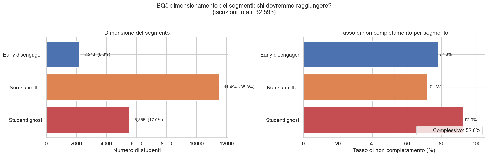

*Dimensione dei tre segmenti target e relativo tasso di non completamento, a confronto con il valore complessivo 
riscontrato in piattaforma.*

### I tre interventi

| | Attivazione Ghost                                                                    | Checkpoint Valutazioni                                                   | Re-engagement Settimana 3                                                                     |
|---|--------------------------------------------------------------------------------------|--------------------------------------------------------------------------|-----------------------------------------------------------------------------------------------|
| **Priorità** | 1: Quick win                                                                         | 2: Costruire dopo                                                        | 3: Investire quando pronti                                                                    |
| **Trigger** | Zero attività VLE\* entro il giorno 3                                                | 3 giorni prima della prima scadenza, non consegnato                      | 3+ giorni consecutivi di inattività dopo attività iniziale                                    |
| **Azione** | Sequenza email: benvenuto giorno 3 e follow-up giorno 7 con link al primo step       | Promemoria con anteprima della valutazione e stima del tempo             | Email "Ci manchi" con riepilogo progressi e confronto con i pari                              |
| **Costo** | **Basso** (solo automazione email)                                                   | **Medio** (trigger consapevoli delle scadenze e calendario del corso)    | **Medio-Alto** (tracciamento attività in tempo reale e personalizzazione)                     |
| **Evidenza** | BQ2: l'engagement precoce è il predittore più forte; BQ3: comportamento > demografia | BQ2: la consegna è un segnale binario chiave; BQ1: cliff alle scadenze | BQ1: cliff di abbandono a metà corso alle settimane 3-4; BQ2: predittore ultimo giorno attivo |
| **Stima impatto** | Maggiore: divario più ampio tra segmento e tasso della piattaforma                   | Medio: divario sostanziale submitter vs non-submitter                    | Medio: intercetta una modalità di abbandono diversa da quella dei ghost                       |

\* VLE = Virtual Learning Environment, la piattaforma online dove vivono i contenuti del corso.

**Approccio alla stima dell'impatto:** per ogni intervento modelliamo scenari di conversione prudenti, in cui si 
ipotizza che cambi comportamento solo il 10–25% degli studenti raggiunti.
Si assume inoltre che gli studenti ghost convertiti possano raggiungere il tasso medio di completamento della 
piattaforma (non quello degli studenti attivi) e che gli studenti re-ingaggiati si fermino a un tasso a metà strada 
tra disimpegnati e costanti. 
Queste sono assunzioni deliberatamente conservative.

### Sovrapposizione dei segmenti

Gli studenti ghost e i non-submitter si **sovrappongono fortemente**: uno studente con zero accessi al VLE non può 
consegnare una valutazione. Questo significa che gli interventi 1 e 2 raggiungono in larga misura la stessa 
popolazione da angolazioni diverse. Il loro impatto non va quindi ingenuamente sommato. 
Gli early disengager, per definizione, hanno invece avuto un'attività iniziale: si sovrappongono meno con i ghost, 
e questo rende il terzo intervento ([Re-engagement Settimana 3](#i-tre-interventi)) una leva indipendente, che 
intercetta una modalità di abbandono diversa.

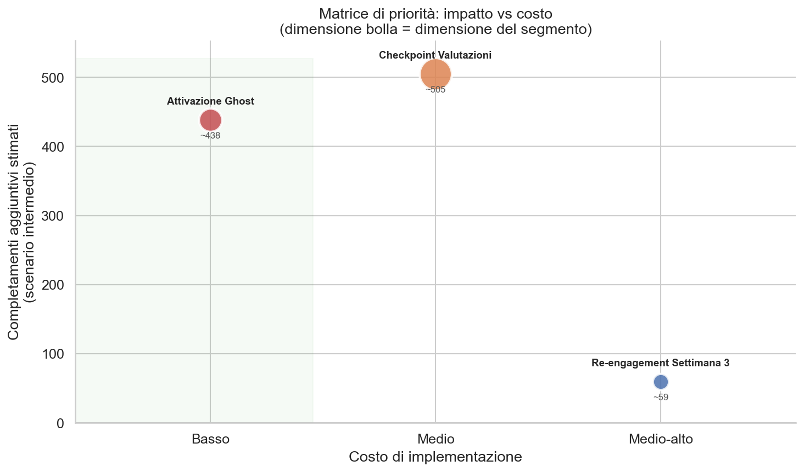

*Matrice priorità impatto-costo. L'Attivazione Ghost è il chiaro quick win (il massimo risultato con lo sforzo 
minimo): segmento più grande, eccesso di non completamento più alto e costo più basso.*

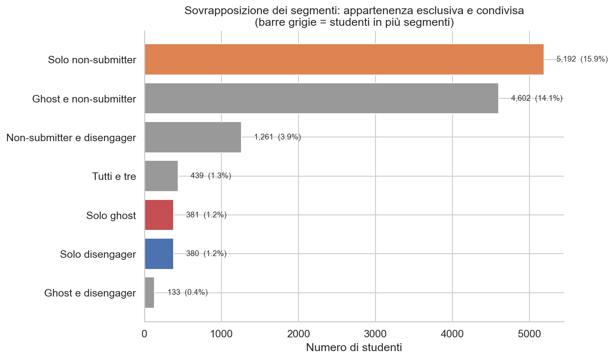

*Analisi della sovrapposizione dei segmenti. Le barre grigie mostrano studenti
appartenenti a più segmenti. La sovrapposizione ghost–non-submitter è sostanziale.*

---

 

## Limitazioni e avvertenze

- **Solo dati osservazionali.** Tutti gli effect size e le differenze nei tassi di completamento sono associazioni, 
non relazioni causali. Gli studenti più attivi potrebbero essere intrinsecamente più motivati: 
l'engagement potrebbe essere un proxy (un indicatore che riflette altro, per esempio la motivazione), non una causa.

- **Dati storici.** OULAD copre le coorti 2013–2014 della Open University (UK). I comportamenti degli studenti e le 
piattaforme di apprendimento online sono cambiati significativamente da allora.

- **BQ4 limitato da n = 7.** Con soli 7 moduli, nessuna statistica inferenziale è possibile per l'analisi a livello di 
corso. I pattern sulle caratteristiche del design sono ipotesi, non conclusioni.

- **Le stime di impatto sono assunzioni.** I tassi di conversione (10–25%) sono proiezioni plausibili basate su 
benchmark di settore, non su risultati misurati. Non esistono dati di A/B testing nel dataset.

- **Nessun dato sui costi.** Le stime dei costi di implementazione (Basso / Medio / Medio-Alto) sono qualitative. 
Lo sforzo ingegneristico effettivo dipende dall'infrastruttura della piattaforma esistente.
 

- **Nota etica.** Tutti gli interventi agiscono sul comportamento, non sulla demografia. Le comunicazioni 
automatiche verso gli studenti dovrebbero sempre includere un meccanismo di cancellazione (opt-out), per 
rispettare l'autonomia degli studenti.

---

 

## Appendice: provenienza dei grafici e dei numeri

Tutte le figure di questo report sono generate dai 7 notebook di analisi in [`notebooks/`](../../notebooks/): 
il prefisso numerico del file immagine corrisponde al notebook che lo produce (per esempio 
`03_dropout_curves_overlaid.png` nasce da `03_bq1_dropout_timing.ipynb`). 
I notebook leggono i CSV esportati dalla pipeline e salvano ogni figura in due lingue, con lo stesso nome file: 
inglese in `reports/figures/` (usata dai documenti EN), italiano in `reports/figures/it/` (usata da questo report 
e dal README italiano).

I numeri citati nel testo sono verificati sugli stessi CSV esportati dalla pipeline, in particolare sugli export 
statistici (`stats_*.csv`) per effect size e intervalli di confidenza. 
Le istruzioni per rigenerare figure e dati da un clone del repository sono nel [README](../../it/README.md), 
sezione Avvio Progetto.
